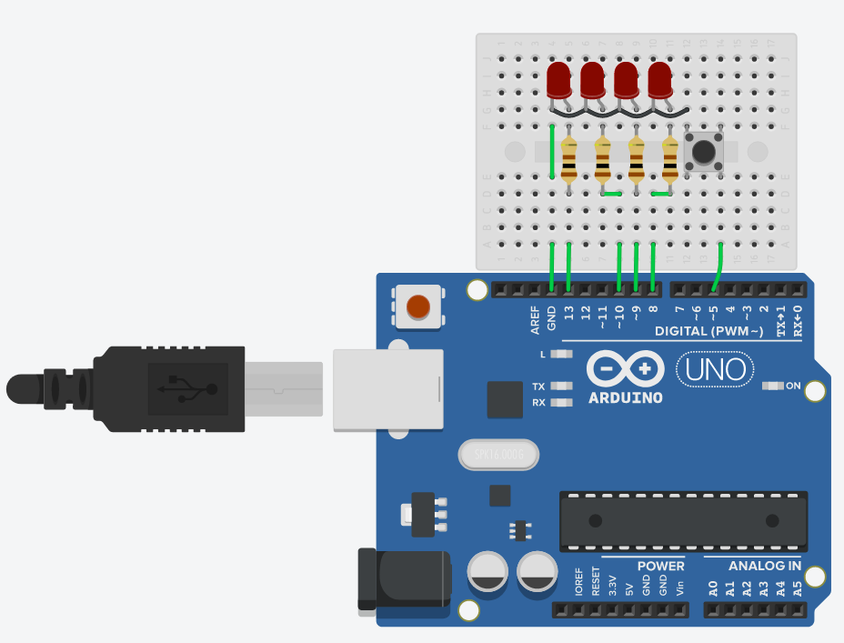

## 4 Bit Counter
This mini project display and increments the 4 bits (led) when a push button is pressed. Set the serial monitor at 9600 baud to see the counter value.

### Components
*	Red LED (4x)
*	100 Ω Resistor (4x)
*	Arduino Uno R3 (1x)
* Push Button (1x)

### Circuit diagram

