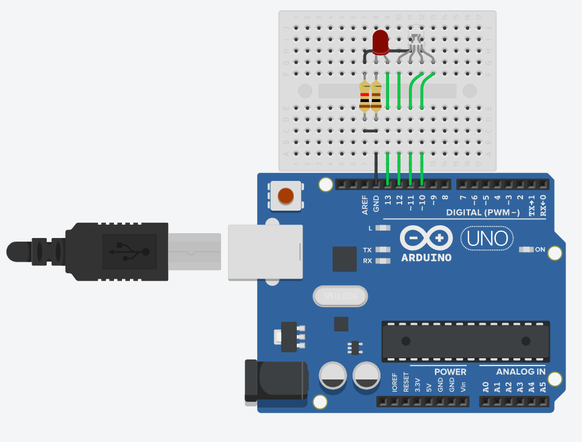

## LED - RGB
This mini project display pattern that alternate between red and a red-green-blue diodes.

### Components
*	LED RGB (1x)
* 1 kΩ Resistor (1x)
*	Arduino Uno R3 (1x)
*	Red LED (1x)
*	100 Ω Resistor (1x)

### Circuit diagram

