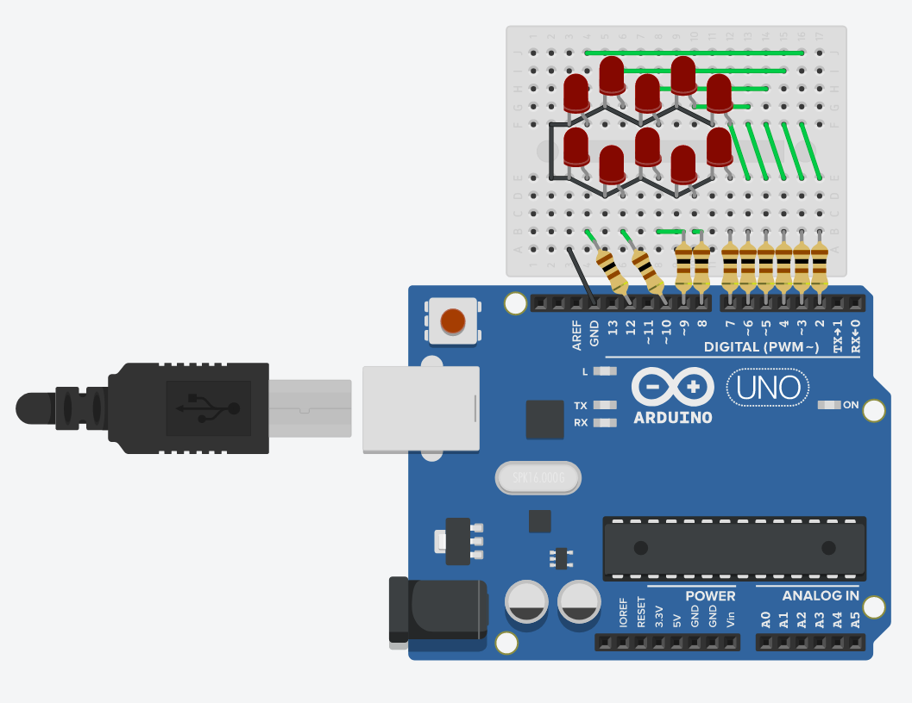

## Running-8-led
This mini project display pattern that alternate between led arranged in the shape of 8

### Components
*	Red LED (10x)
*	100 Ω Resistor (10x)
*	Arduino Uno R3 (1x)

### Circuit diagram

