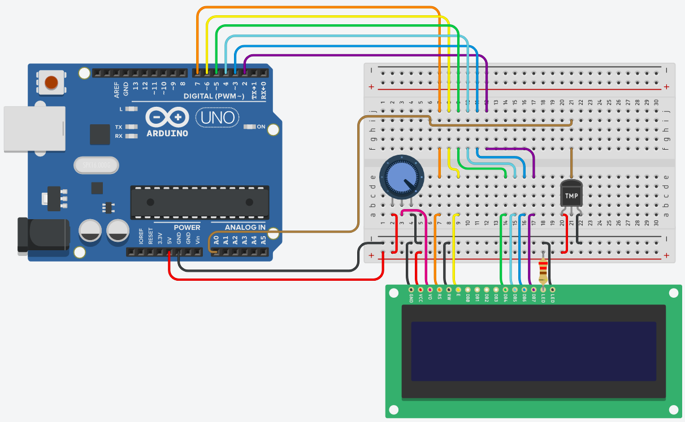

## Temperature Display
This mini project monitors the temperature using a temperature sensor and displays it in the LCD monitor.

### Components
* Arduino Uno R3 (1x)
* LCD 16 x 2 (1x)
* 250 kΩ Potentiometer (1x)
* 220 Ω Resistor (1x)
* Temperature Sensor [TMP36] (1x)

### Additional Library
* LiquidCrystal.h

### Circuit diagram

