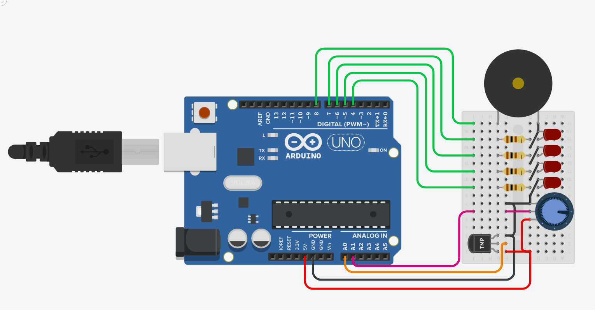

## Temperature Alarm
This mini project monitors the temperature using a temperature sensor. Leds show the level of heat detected. A potentiometer is used to adjust the threshold temperature so that when the temperature rises above the threshold, a buzzer is activated.

The min and max temperature needs to be updated in the code.

### Components
*	Arduino Uno R3 (1x)
* Red LED (4x)
* 100 Ω Resistor (4x)
* 250 kΩ Potentiometer (1x)
* Temperature Sensor [TMP36] (1x)
* Piezo (1x)

### Circuit diagram

